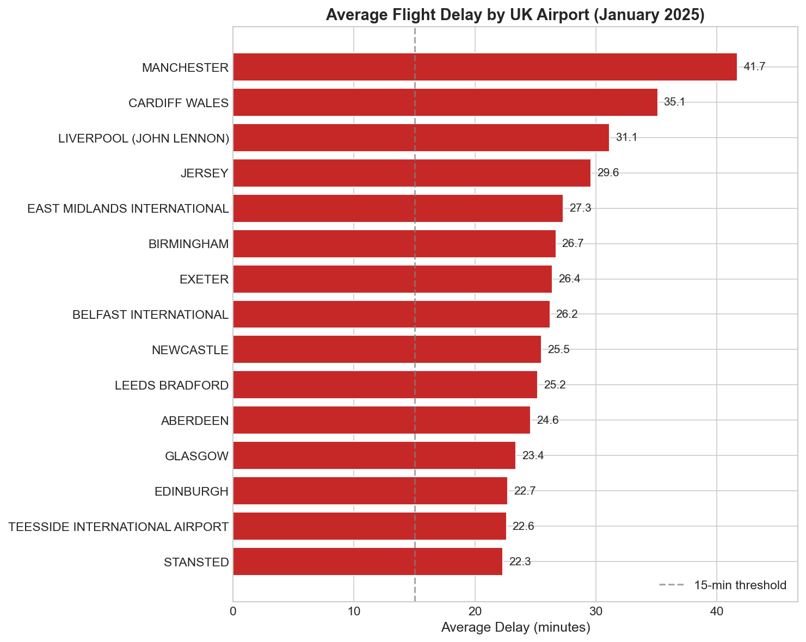
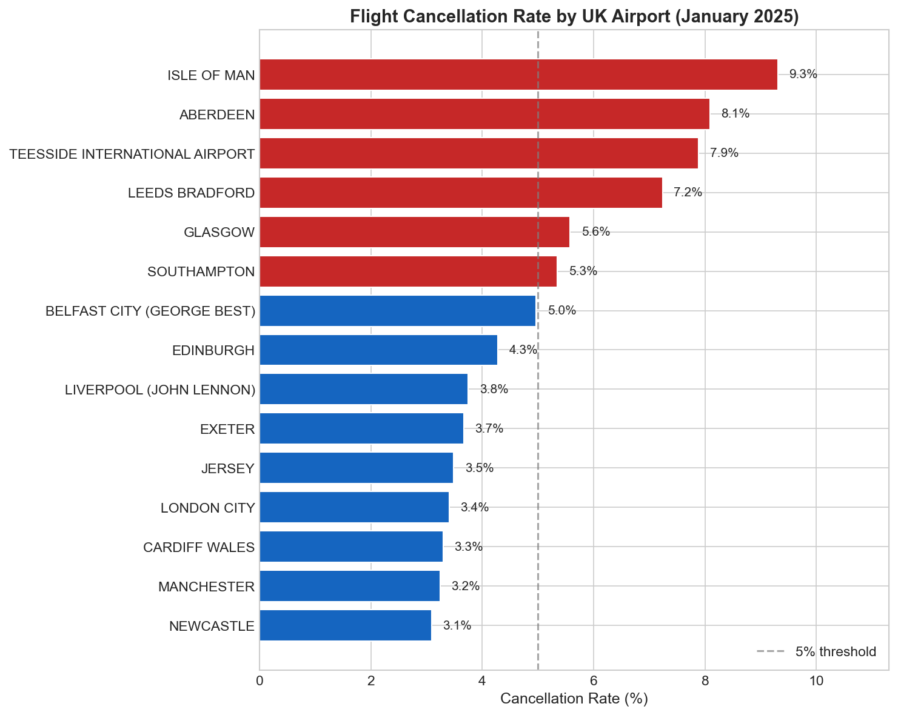
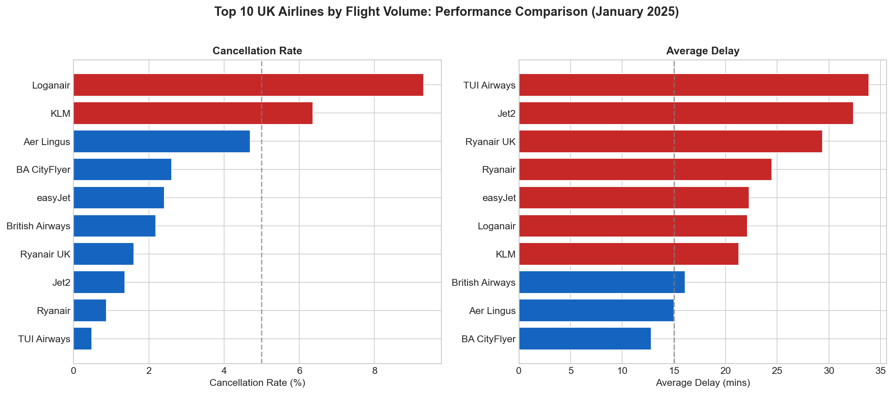
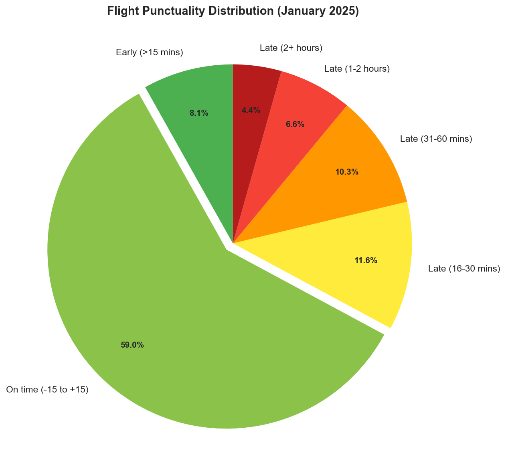
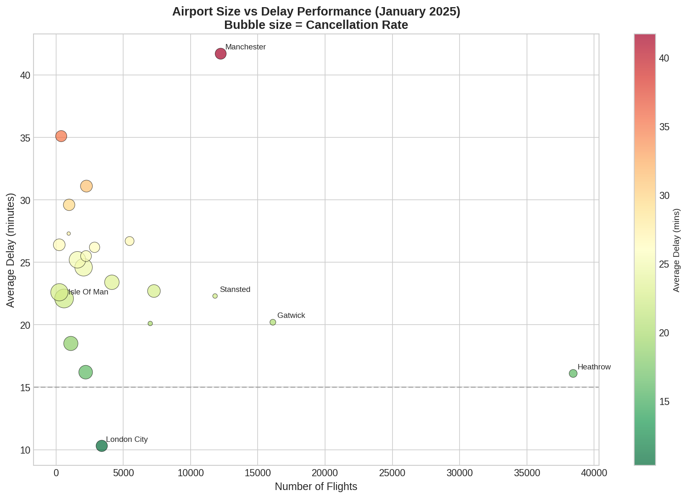
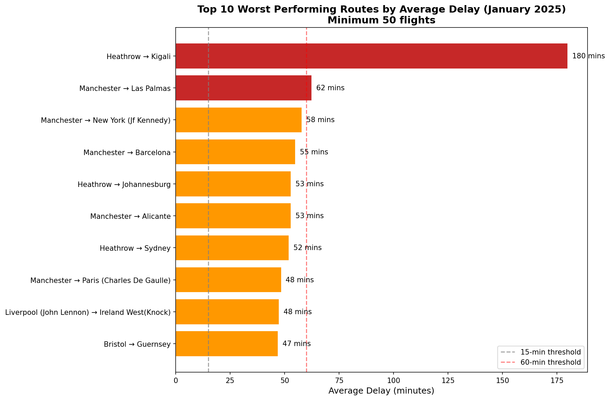

# UK Flight Punctuality Analysis: January 2025

**A Data Science Portfolio Project**

---

## 1. Executive Summary

This project examines whether flight disruption across UK aviation is evenly distributed or concentrated in particular airports, airlines, and routes. This matters because poor punctuality affects passenger experience, operational efficiency, and service reliability.

Using January 2025 UK Civil Aviation Authority data, the analysis shows that disruption is not evenly distributed. Some airports and routes perform consistently better than others, while a smaller set of operators and routes account for a disproportionate share of poor outcomes. London City records comparatively low average delays, several regional airports report higher cancellation rates, and a small number of long-haul routes show unusually high delay values. These findings show how descriptive analysis can identify operational outliers and support more targeted decision-making.

The project also demonstrates a clear data science workflow: profiling, cleaning, transformation, aggregation, and visual communication. This is important because transparent and reproducible methods are expected in both academic and professional settings.

---

## 2. Data Infrastructure and Tools

### 2.1 Data Source

The dataset was taken from the UK Civil Aviation Authority open data portal, using the January 2025 Punctuality Statistics release (Civil Aviation Authority, 2025). This is an appropriate source because it is official, public, and covers UK airports with significant commercial activity.

The file contains 5,354 route-level records and 26 variables, including reporting airport, origin or destination, airline, arrival or departure indicator, flight volumes, delay distribution percentages, cancellations, and year-on-year comparisons.

### 2.2 Tool Selection

Python was selected as the main analysis tool because it supports reproducible data handling, analysis, and visualisation (McKinney, 2017). The pandas library is well suited to structured tabular data of this size and is more reliable than a manual spreadsheet-only workflow.

```python
import pandas as pd
import numpy as np
import matplotlib.pyplot as plt
import seaborn as sns

# Load and inspect data structure
df = pd.read_csv('202501_Punctuality_Statistics.csv')
print(f"Dataset shape: {df.shape}")
```

This choice supports both accessibility and analytical rigour.

---

## 3. Data Engineering

### 3.1 Data Profiling and Quality Assessment

Initial profiling showed that the dataset required limited cleaning, which is consistent with an official source. However, preprocessing was still necessary to ensure valid comparisons.

```python
# Filter for routes with actual flights
df_active = df[df['number_flights_matched'] > 0].copy()
print(f"Active routes: {len(df_active)} of {len(df)} total records")
```

Of the 5,354 total records, 4,621 contained matched flights. The remaining 733 related to routes with no flights in the period and were removed from delay calculations to avoid misleading averages and division errors.

### 3.2 Data Transformation

Derived metrics were created for on-time performance and cancellation rate.

```python
# Calculate on-time percentage (within 15 minutes of schedule)
df_active['on_time_pct'] = (
    df_active['flights_more_than_15_minutes_early_percent'] +
    df_active['flights_15_minutes_early_to_1_minute_early_percent'] +
    df_active['flights_0_to_15_minutes_late_percent']
)

# Calculate cancellation rate per airport
airport_stats = df_active.groupby('reporting_airport').agg({
    'number_flights_matched': 'sum',
    'number_flights_cancelled': 'sum',
    'average_delay_mins': 'mean'
})
airport_stats['cancellation_rate'] = (
    airport_stats['number_flights_cancelled'] / 
    (airport_stats['number_flights_matched'] + 
     airport_stats['number_flights_cancelled']) * 100
).round(2)
```

These steps converted raw operational data into measures that could be compared more clearly across airports, airlines, and routes.

### 3.3 Aggregation Strategy

The data was aggregated at airport, airline, and route level. This allowed performance to be examined from more than one perspective instead of relying on a single overall average. That approach is consistent with established aviation analysis practice (Belobaba, Odoni and Barnhart, 2015).

---

## 4. Data Visualisation and Communication

The visual outputs were designed to communicate results clearly to both technical and non-technical audiences, using clear labels and consistent scales (Tufte, 2001).

### 4.1 Airport Delay Performance


*Figure 1: Average flight delay by UK airport. Red bars indicate airports with average delays above 20 minutes.*

This visual shows marked variation between airports. Manchester records the highest average delay at 41.7 minutes, while London City records 10.3 minutes. This suggests that airport size alone does not explain delay performance.

### 4.2 Cancellation Rate Distribution


*Figure 2: Flight cancellation rates by UK airport. Red bars indicate airports with cancellation rates above 5%.*

Several regional airports have materially higher cancellation rates than larger hubs, including the Isle of Man, Aberdeen, and Teesside.

### 4.3 Airline Performance Comparison


*Figure 3: Top 10 airlines by flight volume, showing cancellation rates and average delays.*

Grouping the data by airline identifies measurable differences in reliability.

```python
# Aggregate by airline
airline_stats = df_active.groupby('airline_name').agg({
    'number_flights_matched': 'sum',
    'number_flights_cancelled': 'sum',
    'average_delay_mins': 'mean'
}).round(1)

airline_stats['cancellation_rate'] = (
    airline_stats['number_flights_cancelled'] / 
    (airline_stats['number_flights_matched'] + 
     airline_stats['number_flights_cancelled']) * 100
).round(2)
```

Among the 10 highest-volume carriers, Loganair records the highest cancellation rate at 9.3%, Ryanair the lowest at 0.9%, and TUI Airways the highest average delay at 24.1 minutes. British Airways, with 23,440 flights, records a 2.2% cancellation rate and a 15.8-minute average delay.

### 4.4 On-Time Performance Distribution


*Figure 4: Distribution of punctuality categories, showing an overall on-time performance level of 66%.*

This figure shows that around one-third of flights fall outside the on-time threshold.

### 4.5 Airport Size vs Delay Performance


*Figure 5: Relationship between airport traffic volume and average delay. Bubble size indicates cancellation rate.*

The scatter plot indicates that traffic volume alone does not predict poor punctuality. Heathrow handles a high number of flights without showing delays on the same scale as some smaller airports.

### 4.6 Route-Level Analysis


*Figure 6: Top 10 worst-performing routes by average delay, using a minimum threshold of 50 flights.*

Route-level analysis identifies specific services associated with poor punctuality.

```python
# Aggregate by route
route_stats = df_active.groupby(
    ['reporting_airport', 'origin_destination', 'airline_name']
).agg({
    'number_flights_matched': 'sum',
    'average_delay_mins': 'mean'
})
busy_routes = route_stats[route_stats['number_flights_matched'] >= 50]
```

The Heathrow-Kigali route records the highest average delay at 180 minutes. Manchester also appears repeatedly among the worst-performing routes, including services to Las Palmas, New York JFK, and Barcelona.

---

## 5. Data Analytics

### 5.1 Analytical Methods

The project uses descriptive and comparative analysis rather than predictive modelling because the aim is to explore disruption patterns and identify performance differences.

```python
# Identify worst-performing routes with sufficient sample size
route_stats = df_active.groupby(
    ['reporting_airport', 'origin_destination', 'airline_name']
).agg({
    'number_flights_matched': 'sum',
    'average_delay_mins': 'mean'
})
busy_routes = route_stats[route_stats['number_flights_matched'] >= 50]
worst_routes = busy_routes.sort_values('average_delay_mins', ascending=False)
```

Filtering and ranking were used to improve reliability and highlight outliers.

### 5.2 Key Findings

Airport size does not appear to be a reliable predictor of delay performance. Regional airports record higher cancellation rates than major hubs. Some individual routes perform substantially worse than the wider network, especially Heathrow-Kigali. Overall on-time performance stands at 66%, meaning a significant share of flights were delayed beyond 15 minutes.

### 5.3 Ethical Considerations

The analysis uses publicly available, aggregated data and therefore does not involve personally identifiable information. However, the scope is limited to January 2025, so the results may reflect seasonal or weather-related effects rather than typical annual performance.

---

## 6. Recommendations for Future Work

Future work could extend the analysis by using a full 12 months of data to test whether the January pattern remains consistent. External weather data could also be added to distinguish likely environmental disruption from operational causes. A later stage could introduce predictive modelling. Statistical testing could also strengthen the analysis by assessing whether the differences identified are statistically significant.

---

## References

Belobaba, P., Odoni, A. and Barnhart, C. (2015) *The Global Airline Industry*. 2nd edn. Chichester: John Wiley & Sons.

Civil Aviation Authority (2024) *UK Aviation Consumer Survey*. Available at: https://www.caa.co.uk/data-and-analysis/ (Accessed: 13 March 2026).

Civil Aviation Authority (2025) *Punctuality Statistics 2025*. Available at: https://www.caa.co.uk/data-and-analysis/uk-aviation-market/flight-punctuality/uk-flight-punctuality-statistics/2025/ (Accessed: 13 March 2026).

McKinney, W. (2017) *Python for Data Analysis*. 2nd edn. Sebastopol: O'Reilly Media.

Tufte, E. R. (2001) *The Visual Display of Quantitative Information*. 2nd edn. Cheshire: Graphics Press.

---

*Data source: UK Civil Aviation Authority, January 2025 Punctuality Statistics*  
*Analysis environment: Python 3.x (pandas, numpy, matplotlib, seaborn)*  

